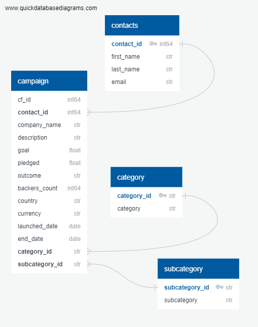

# Crowdfunding_ETL

**About this project:**

This project utilizes the ETL (extract, transform, load ) pipeline. We used Python, Pandas, and Python dictionary methods to extract and transform the data from two xlsx files. After the data was transformed, we created four CSV files and used the data to create an ERD and Table schema with quickDB. The data from the CSV file was then uploaded and viewed in Postgres/ using SQL. 

*Refer to Jupyter notebook for more detailed notes for extract and transfrom process*

*Refer to images folder to view load process in pgAdmin/Postgres*

*Resources folder contains xlsx files and csv output*

**Entity Relationship Diagram:**
